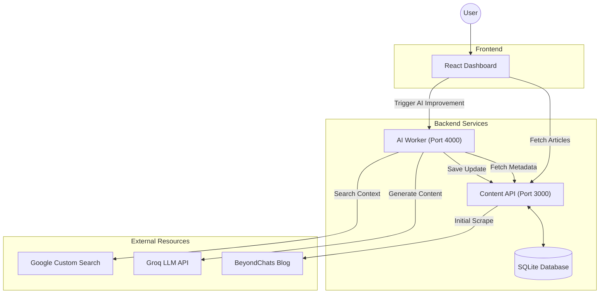

# BeyondChats Full Stack Assignment – AI Article Improver

A full-stack application that scrapes blog articles, researches them using Google Search and Competitor Analysis, and uses an LLM (Groq / Llama-3) to rewrite them into comprehensive, Markdown-formatted posts.

This project is designed using a Microservices Architecture with two independent backend services and a React frontend.

---

## Architecture & Data Flow



---

## Tech Stack

### Frontend

* React.js
* Axios
* React-Markdown
* Lucide Icons

### Backend 1 – Content API

* Node.js
* Express.js
* Cheerio (Web scraping)
* SQLite (Persists article data)

### Backend 2 – AI Worker

* Node.js
* Cheerio (Web scraping)
* Groq SDK (AI content generation)

---

## Local Setup Instructions

This project follows a **Microservices Architecture**. To run the application successfully, you must run the **Content API**, **AI Worker**, and **Frontend** in **three separate terminals** simultaneously.

### 1. Prerequisites

Ensure you have the following installed on your machine:

* **Node.js** (v16.0.0 or higher) - [Download Here](https://nodejs.org/)
* **Git** - [Download Here](https://git-scm.com/)

Verify your installation by running:

```bash
node -v
npm -v

```

### 2. Environment Variables

The backend requires API keys to perform Google Searches and generate AI content.

Create a file named `.env` in the root directory of the project.

Paste the following keys into the file:

```env
# Google Custom Search API Key (for searching articles)
GOOGLE_API_KEY=your_google_api_key

# Google Search Engine ID (Programmable Search Engine)
SEARCH_ENGINE_ID=your_search_engine_id

# Groq Cloud API Key (for Llama-3 LLM)
GROQ_API_KEY=your_groq_api_key

```

### 3. Terminal 1: Content API (Port 3000)

This service manages the database and handles the initial blog scraping.

Open a terminal in the root directory.

Install dependencies and start the server:

```bash
npm install
node index.js

```

Expected Output:

```text
Example app listening on port 3000

```

*(Note: If the database is empty, it may immediately start scraping articles.)*

### 4. Terminal 2: AI Worker (Port 4000)

This background service handles the heavy lifting: Google search, competitor scraping, and AI content generation.

Open a new terminal window (keep Terminal 1 running).

Ensure you are in the root directory.

Start the worker script:

```bash
node improve_article.js

```

Expected Output:

```text
AI Worker listening on port 4000

```

### 5. Terminal 3: React Frontend

The user interface for viewing and managing articles.

Open a third terminal window.

Navigate to the client folder and start the app:

```bash
cd client
npm install
npm start

```

Expected Output:

The terminal will compile the React application.

Your default browser will automatically open to `http://localhost:3000` (or `http://localhost:3001` if port 3000 is busy).

---

## Usage Guide

### Initial Load

When the dashboard opens, it automatically connects to the Content API (Port 3000).

If the database is empty, the system will trigger a scrape of the 5 oldest articles from the BeyondChats blog.

*Tip: Refresh the page if articles do not appear immediately.*

### View Original Content

You will see cards for each scraped article.

Click the "Read Original" button on any card to view the raw text scraped from the source.

### Improve Content with AI

Click the "Improve Content with AI" button in the top header.

This sends a trigger to the AI Worker (Port 4000).

Check Terminal 2 to see the real-time logs:

* Searching Google...
* Scraping Competitors...
* Generating AI Content...

*Note: This process takes approximately 30-40 seconds per article.*

### Compare Versions

Once the process finishes (check Terminal 2 for "Database Updated"), the frontend will refresh.

The cards will now show a green "Enhanced" badge.

Click "Compare Versions" to open a split-screen modal showing the Original text alongside the new, Markdown-formatted AI version.

### View Original Content

* Click "Read Original" on any article card to view the raw scraped content

### Improve Content with AI

1. Click "Improve Content with AI" in the header
2. A request is sent to the AI Worker (Port 4000)
3. Monitor Terminal 2 logs:
* Searching Google
* Scraping competitors
* Generating AI content


Note: This process takes approximately 30 seconds per article.

### Compare Versions

* Once processing completes, the UI refreshes
* Click "Compare Versions" to view:
* Original scraped content
* AI-enhanced Markdown version side-by-side


---

## Project Structure

```plaintext
beyondchats-assignment/
├── client/                 # React Frontend Application
│   ├── src/
│   │   ├── App.js          # Main UI Logic
│   │   └── App.css         # Styling
├── index.js               # Service 1: Database API and CRUD
├── improve_article.js     # Service 2: AI Research Agent
├── database.db            # Local SQLite Database
├── package.json           # Backend Dependencies
└── README.md              # Documentation

```

---

## Key Highlights

* Microservices-based architecture
* Real-world scraping and research pipeline
* LLM-powered content enhancement
* Clean Markdown output for publishing
* Fully local, easy-to-run setup
  
---
## Images


---

Built for the BeyondChats Full Stack Assignment
